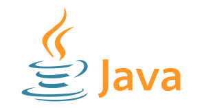

# Spanish
Este repositorio contiene las soluciones al curso "Java Programming II" de la Universidad de Helsinki, continuación de la primera parte. Lo he creado para tener los ejercicios disponibles en caso de que necesite revisarlos en el futuro y para ayudar a quienes puedan sentirse atascados con algún ejercicio.

Importante: Este repositorio no está pensado para copiar y pegar las soluciones directamente. El aprendizaje real proviene de trabajar los problemas por tu cuenta, incluso si lleva horas resolver un ejercicio. Copiar soluciones de internet no solo va en contra del propósito del aprendizaje, sino que también limita tu progreso. Utiliza estas soluciones como guía, no como un atajo.

# ¿Qué tal fue el curso?
Sinceramente el mejor curso de Java disponible, cuesta creer que sea gratuito, una cantidad grandísima de ejercicios y todo muy bien explicado y con pautas, me ha dado la motivación para esforzarme día tras día.

# English
This repository contains the solutions to the "Java Programming I" course from the University of Helsinki. I created it to have the exercises readily available for future review and to help those who might feel stuck on an exercise by providing a reference example.

Important: This repository is not intended for copying and pasting solutions directly. True learning comes from working through problems on your own, even if it takes hours to solve an exercise. Copying solutions from the internet goes against the purpose of learning and limits your progress. Use these solutions as a guide, not as a shortcut.

